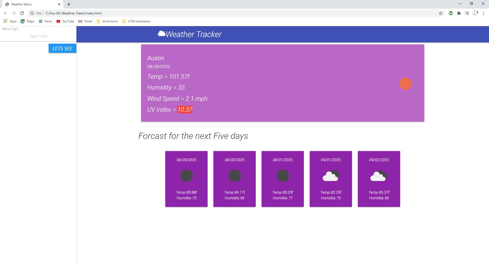

# 06 Server-Side APIs: Weather Tracker

This is the weather API homework five day forcast with the the UV rating with color changing functions
a preview image:

You can you use the local history for searchs of cities for their weather

Thank you for your time,

 Author: Stephen Fink